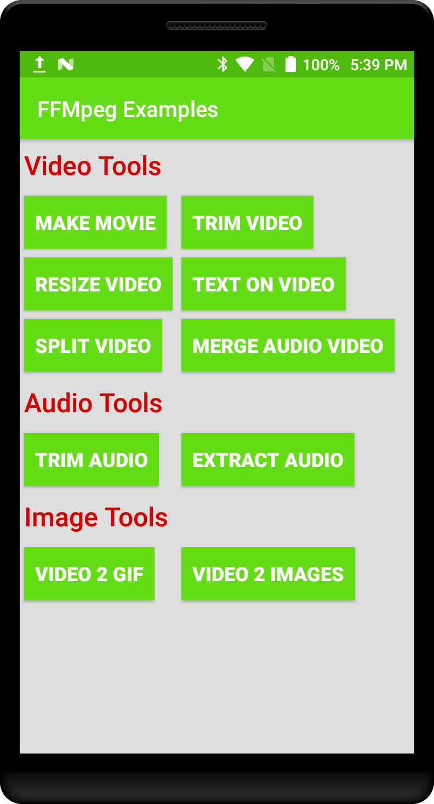
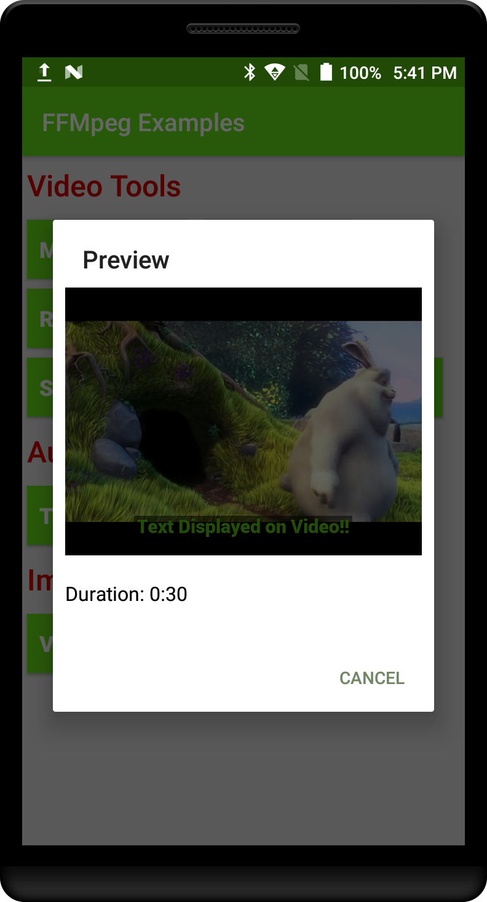

# Kotlin FFMpeg Tools  
### Examples of using FFMpeg library on Android with Kotlin
##### `For Video, Audio and Image/GIF operations`. 

App is pre loaded with audio, video, images, font resources which are useful for experimenting with FFmpeg library. You can add your resources as well, but keep extensions and make sure naming conventions are same as used in this project to avoid any I/OExceptions.

Each example will preview result in a dialog. Files are saved in local storage directory and can be directly accessed from there.

### FFMpeg Examples (Video):

1. Split a video in equal segments

       VideoSplitter.with(context!!)
                        .setFile(video) //Video File
                        .setOutputPath("PATH_TO_OUTPUT_VIDEO")
                        .setSegmentTime("00:00:15") //Split into 15 seconds segment
                        .setOutputFileName("splittedVideo")
                        .setCallback(this@MainActivity)
                        .split()
                        
2. Trim a video with specified timestamps

        VideoTrimmer.with(context!!)
                        .setFile(video) //Video File
                        .setStartTime("00:00:15") // Start from 15 seconds
                        .setEndTime("00:00:25") //End on 25 seconds
                        .setOutputPath("PATH_TO_OUTPUT_VIDEO")
                        .setOutputFileName("trimmed_" + System.currentTimeMillis() + ".mp4")
                        .setCallback(this@MainActivity)
                        .trim()

3. Make a MP4 movie with provided images & audio in mp3

         MovieMaker.with(context!!)
                                .setAudio(audio2) //Audio File
                                .setOutputPath("PATH_TO_OUTPUT_VIDEO")
                                .setOutputFileName("movie_" + System.currentTimeMillis() + ".mp4")
                                .setCallback(this@MainActivity)
                                .convert()

4. Resize a video in specified dimensions

        VideoResizer.with(context!!)
                                .setFile(video2) //Video File
                                .setSize("320:480") //320 X 480
                                .setOutputPath("PATH_TO_OUTPUT_VIDEO")
                                .setOutputFileName("resized_" + System.currentTimeMillis() + ".mp4")
                                .setCallback(this@MainActivity)
                                .resize()

5. Add Text overlay on video with specified text attributes

        TextOnVideo.with(context!!)
                                .setFile(video2) //Video File
                                .setOutputPath("PATH_TO_OUTPUT_VIDEO")
                                .setOutputFileName("textOnVideo_" + System.currentTimeMillis() + ".mp4")
                                .setFont(font) //Font .ttf of text
                                .setText("Text Displayed on Video!!") //Text to be displayed
                                .setColor("#50b90e") //Color of Text
                                .setSize("34") //Size of text
                                .addBorder(true) //This will add background with border on text
                                .setPosition(TextOnVideo.POSITION_CENTER_BOTTOM) //Can be selected
                                .setCallback(this@MainActivity)
                                .draw()
        
6. Merge an audio over video file

        AudioVideoMerger.with(context!!)
                                .setAudioFile(audio) //Audio File
                                .setVideoFile(video2) //Video File
                                .setOutputPath("PATH_TO_OUTPUT_VIDEO")
                                .setOutputFileName("merged_" + System.currentTimeMillis() + ".mp4")
                                .setCallback(this@MainActivity)
                                .merge()
                                
7. Merge/Concatenate multiple video files into single video file

        val videoList = arrayListOf<File>(videoSmall1, video, video2)
        
        VideoMerger.with(context!!)
                                .setVideoFiles(videoList) //Video Files list
                                .setOutputPath("PATH_TO_OUTPUT_VIDEO")
                                .setOutputFileName("merged_" + System.currentTimeMillis() + ".mp4")
                                .setCallback(this@MainActivity)
                                .merge()

### FFMpeg Examples (Audio):

1. Trim a audio with specified timestamps

        AudioTrimmer.with(context!!)
                                .setFile(audio2) //Audio File
                                .setStartTime("00:00:05") //Start at 5 seconds
                                .setEndTime("00:00:10") //End at 10 seconds
                                .setOutputPath("PATH_TO_OUTPUT_AUDIO")
                                .setOutputFileName("trimmed_" + System.currentTimeMillis() + ".mp3")
                                .setCallback(this@MainActivity)
                                .trim()

2. Extract audio file from video file

        AudioExtractor.with(context!!)
                                .setFile(video2) //Video File
                                .setOutputPath("PATH_TO_OUTPUT_AUDIO")
                                .setOutputFileName("audio_" + System.currentTimeMillis() + ".mp3")
                                .setCallback(this@MainActivity)
                                .extract()

3. Merge/Overlay two Audio files

        AudioMerger.with(context!!)
                               .setFile1(audio2)
                               .setFile2(audio3)
                               .setOutputPath(Utils.outputPath + "audio")
                               .setOutputFileName("merged_" + System.currentTimeMillis() + ".mp3")
                               .setCallback(this@MainActivity)
                               .merge()

### FFMpeg Examples (Image):

1. Convert video to GIF 

        VideoToGIF.with(context!!)
                                .setFile(video) //Video File
                                .setOutputPath("PATH_TO_OUTPUT_IMAGE")
                                .setOutputFileName("myGif_" + System.currentTimeMillis() + ".gif")
                                .setDuration("5") //Gif duration
                                .setScale("500") //Size of GIF
                                .setFPS("10") //Frame rate of GIF
                                .setCallback(this@MainActivity)
                                .create()
        
2. Convert video to images every 'n' time

        VideoToImages.with(context!!)
                                .setFile(video2) //Video File
                                .setOutputPath("PATH_TO_OUTPUT_IMAGE")
                                .setOutputFileName("images")
                                .setInterval("0.25") // Extract image every quarter of second (0.25)
                                .setCallback(this@MainActivity)
                                .extract()

### CallBacks:

You can implement callbacks of all tools using: **FFMpegCallback**.
Just implement this in your Activity or Fragment. 

It supports following callbacks:

            override fun onProgress(progress: String) {
                Log.i(TAG, "Running: $progress")
            }
        
            override fun onSuccess(convertedFile: File, type: String) {
                Toast.makeText(this, "Done!", Toast.LENGTH_SHORT).show()
            }
        
            override fun onFailure(error: Exception) {
                error.printStackTrace()
            }
        
            override fun onFinish() {
                //TODO Do something here
            }
        
            override fun onNotAvailable(error: Exception) {
                Toast.makeText(this, "Error: ${error.message}", Toast.LENGTH_SHORT).show()
            }

### Stop/Kill ongoing process:

            fun stopRunningProcess() {
                    FFmpeg.getInstance(this).killRunningProcesses()
            }
            
### Check if any process is running:

            fun isRunning(): Boolean {
                    return FFmpeg.getInstance(this).isFFmpegCommandRunning
            }

### Permissions:

Following permissions must be added to avoid IO exceptions:

    <uses-permission android:name="android.permission.READ_EXTERNAL_STORAGE" />
    <uses-permission android:name="android.permission.WRITE_EXTERNAL_STORAGE" />

### TODO:

* Add preview for 'Extarct Images from Video'

## Acknowledgments:
* This project is extension of work by: [WritingMinds/ffmpeg-android](https://github.com/WritingMinds/ffmpeg-android)
* [android-gif-drawable](https://github.com/koral--/android-gif-drawable?utm_source=android-arsenal.com&utm_medium=referral&utm_campaign=1147)is used for preview of GIF files.

## MIT License

##### Copyright (c) 2018 Muhammad Umair Adil

Permission is hereby granted, free of charge, to any person obtaining a copy of this software and associated documentation files (the "Software"), to deal in the Software without restriction, including without limitation the rights to use, copy, modify, merge, publish, distribute, sublicense, and/or sell copies of the Software, and to permit persons to whom the Software is furnished to do so, subject to the following conditions:

The above copyright notice and this permission notice shall be included in all copies or substantial portions of the Software.

THE SOFTWARE IS PROVIDED "AS IS", WITHOUT WARRANTY OF ANY KIND, EXPRESS OR IMPLIED, INCLUDING BUT NOT LIMITED TO THE WARRANTIES OF MERCHANTABILITY, FITNESS FOR A PARTICULAR PURPOSE AND NONINFRINGEMENT. IN NO EVENT SHALL THE AUTHORS OR COPYRIGHT HOLDERS BE LIABLE FOR ANY CLAIM, DAMAGES OR OTHER LIABILITY, WHETHER IN AN ACTION OF CONTRACT, TORT OR OTHERWISE, ARISING FROM, OUT OF OR IN CONNECTION WITH THE SOFTWARE OR THE USE OR OTHER DEALINGS IN THE SOFTWARE.
